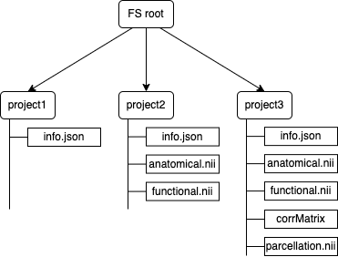

#  Vega (back-end server)

Vega is a back-end part the final qualifying project. The main aim of the web application is to parcellate brain voxels into specific regions based on rs-fMRI data. The algorithm is based on the paper: [Craddock, R. C.; James, G. A.; Holtzheimer, P. E.; Hu, X. P. & Mayberg, H. S.
 A whole brain fMRI atlas generated via spatially constrained spectral
 clustering Human Brain Mapping, 2012, 33, 1914-1928 doi: 10.1002/hbm.21333.](http://www.ncbi.nlm.nih.gov/pubmed/21769991).

### Table of Content:
+ [General Description](#General-Description)
+ [Usecase](#usecase)
+ [Tech Specs](#Tech-Specs)
+ [Back-end server description](#vega)
+ [servers interaction]
(#messaging-with-front-end-server)
+ [Original method's code modifications](#Code-Improvments)


### General Description
Lyra is a web-based application for fMRI brain research. Main usecase: user provide MRI and fMRI data in resting-state and the system perform cluster based segmentation of regions.

### usecase
<p align="center">
</img>
</p>
Default pipeline consisnt of following steps:  

1. Importing data System has intergation with CONN toolbox, but user can also upload NIfTI files from other sources. Main requeirment: data has to be preprocessed (denoising, aligning, etc.);
2. Then user select gray matter mask threshold and start calculationg of correlation matrix for specific subject;
3. After finishing, status of the project will be "ready" and user can select desired number of ROIs and perform brain parcellation.


### Tech Specs
Due to trends of modern applications, it has been decided to develop web-based applicaton with two nodes architecture: 
* GUI server (Lyra) that generates HTML content  
Techologies were used: **javascript, vue.js, quasar framework, niivue**
* Backend server which is used to store files and perform computations on GPU  
Techologies were used: **python, flask**

### Vega
Back-end server consist of three files:  
*server.py* handles general functions such as program's entry-point, user's requests, URL's binds.  
*newProjectHandler.py* stores the user data (matlab files, nifti images), manages simple file system (each project is a separate folder with its own files). During the work with the project, new files will appear in the folder as shown below.

<p align="center">
</img>
</p>

*evaluation.py* is a interface to interact with [Craddock et al., Human Brain Mapp., 33 (9) 2012](https://github.com/ccraddock/cluster_roi)

### Code Improvments
The original [Craddock et al., Human Brain Mapp., 33 (9) 2012](https://github.com/ccraddock/cluster_roi) code has been modified to meet modern trends:
* updated to python3+ version
* added preprocessing filtering
* added GPU support for effective computing
* Hardcoded constants have been brough as functions arguments


### project structure
To support easy access to user's uploaded files. JSON metafile has been created. After clicking "new project" button in web GUI, server creates new folder and JSON metafile:
```json
{
    "name":"my_project.conn", // project name
    "status":"parcellating", // project status
    "parc":["original file","4","5"], // available parcellarions
    "corrThreshold":0.71, // algorithm specific thresholds
    "maskThreshold":0.02
}
```

### messaging with front-end server
For communication, servers are using HTTP protocol as shown on figure below:
<p align="center">
</img>
</p>